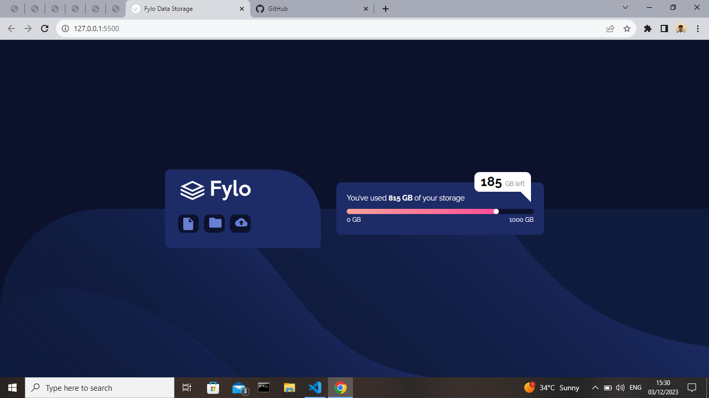

# Frontend Mentor - Fylo data storage component solution

This is a solution to the [Fylo data storage component challenge on Frontend Mentor](https://www.frontendmentor.io/challenges/fylo-data-storage-component-1dZPRbV5n).

## Table of contents

- [Overview](#overview)
  - [The challenge](#the-challenge)
  - [Screenshot](#screenshot)
  - [Links](#links)
- [My process](#my-process)
  - [Built with](#built-with)
  - [What I learned](#what-i-learned)
- [Author](#author)
- [Acknowledgments](#acknowledgments)


## Overview

### The challenge

Users should be able to:

- View the optimal layout for the site depending on their device's screen size

### Screenshot



### Links

- Solution URL: [Solution](https://github.com/Saheedatt/Frontendmentorchallenges/tree/main/fylo-data-storage-component-master)
- Live Site URL: [Add live site URL here](https://your-live-site-url.com)

## My process

### Built with

- Semantic HTML5 markup
- CSS custom properties
- Flexbox


### What I learned

I learnt about the use of flexbox and also tried to understand the use of selectors properly. Also tried to use 
the modern css styling


```html
<h1>Some HTML code I'm proud of</h1>
```
```css
.fylo-card{
    background-color: hsl(228, 56%, 26%);
    display: flex;
    flex-direction: column;
    width: 300px;
    border-top-left-radius: 10px;
    border-bottom-left-radius: 10px;
    border-top-right-radius: 90px;
    border-bottom-right-radius: 5px;
}
```


## Author

- Saheedat Afolabi

## Acknowledgments

Thank you to Frontend Mentor for the opportunity.
